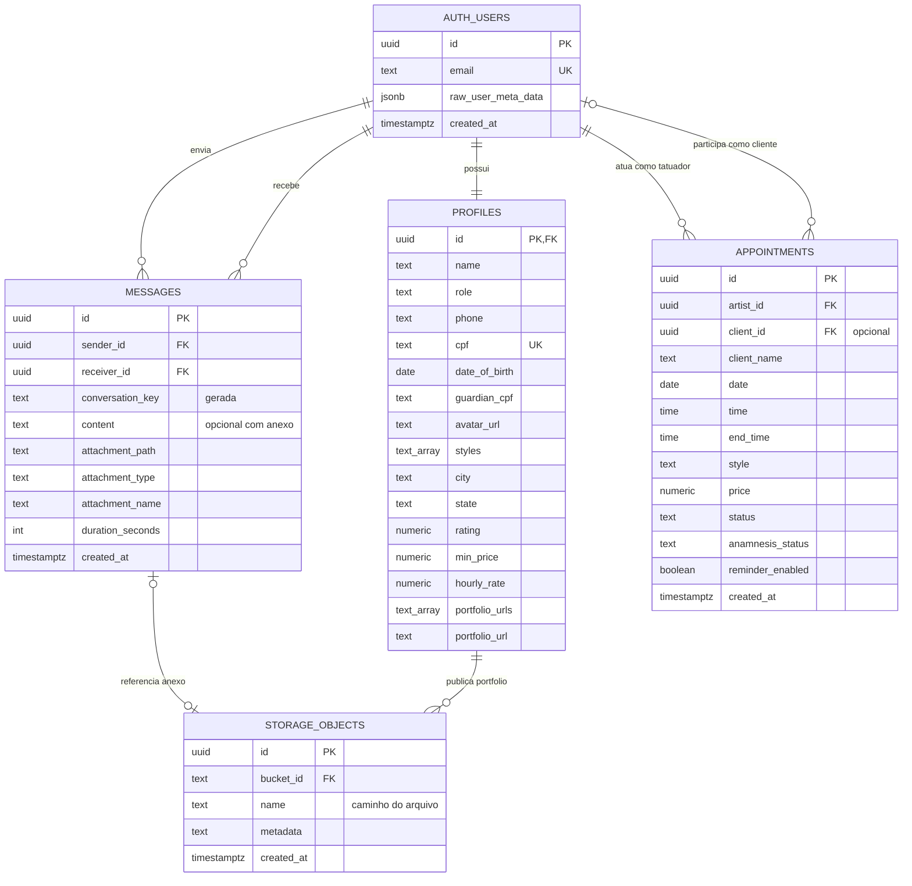

# Diagrama Entidade–Relacionamento — InkFlow

Esta DER representa o schema atualmente versionado nas migrations do Supabase. As views `artist_directory` e `chat_directory` são projeções de leitura e não armazenam dados próprios.

## Cardinalidades principais

- Cada usuário autenticado possui exatamente um perfil em `profiles`.
- Um usuário pode enviar e receber várias mensagens; cada mensagem possui um remetente e um destinatário.
- Um tatuador pode ter vários agendamentos. Um cliente também pode participar de vários agendamentos, mas `client_id` pode ser nulo para registros legados ou clientes ainda não vinculados.
- Uma mensagem pode não possuir anexo ou referenciar um objeto do bucket privado `chat-media` por `attachment_path`.
- Um perfil pode publicar várias imagens no bucket público `portfolio`; as URLs são mantidas em `portfolio_urls`.

## Views de leitura

- `artist_directory`: expõe somente os dados públicos de perfis com `role = 'ARTIST'`.
- `chat_directory`: expõe `id`, nome e avatar apenas de usuários que já possuem histórico de conversa com o usuário autenticado.

## Regras relevantes do banco

- `messages.conversation_key` é gerada pela ordenação dos IDs dos dois participantes.
- `appointments_no_overlap` impede horários sobrepostos para o mesmo tatuador e data.
- `appointments_time_order` exige que `end_time` seja posterior a `time`.
- `messages_content_or_attachment` exige texto preenchido ou anexo.
- `messages_attachment_type_valid` aceita apenas `image`, `video` ou `audio`.
- RLS restringe perfis, mensagens, agendamentos e mídias privadas aos usuários autorizados.

> Observação: as colunas básicas de `profiles` (`id`, `name`, `role`, `phone`, `cpf`, `date_of_birth` e `guardian_cpf`) já existiam antes das migrations versionadas atuais. Elas foram confirmadas pelo trigger, pelas policies e pelos modelos do aplicativo.
